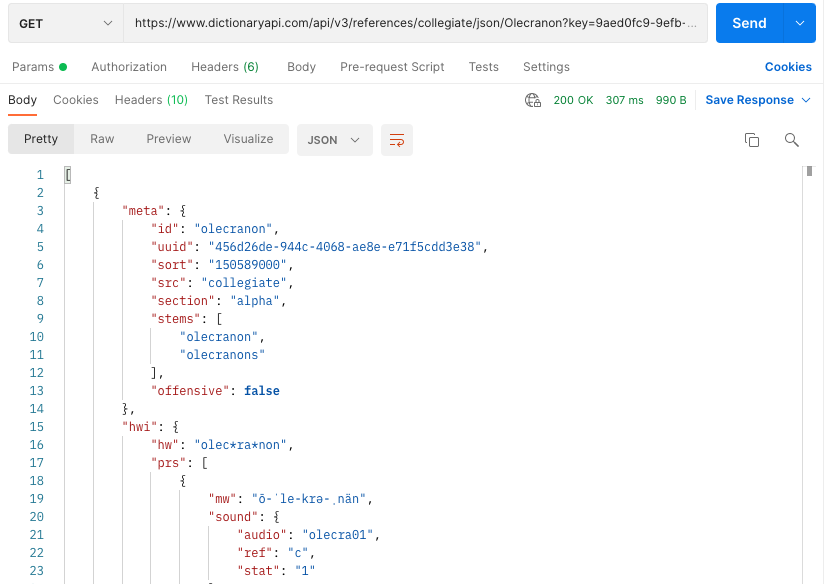
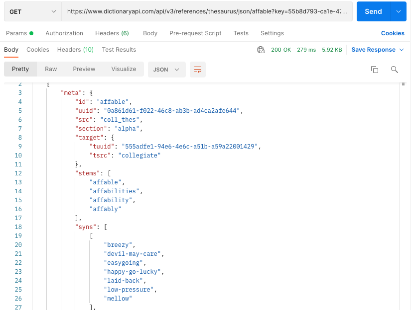
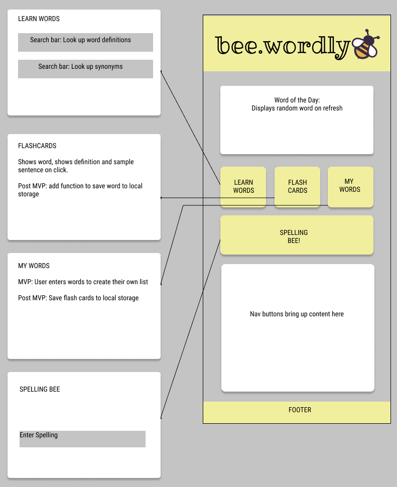
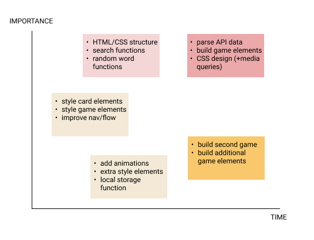

# Project Overview

## bee.wordly

## Project Description
An app that gives you a word of the day, along with search functions for definitions and synonyms, flashcards, and a spelling game to help you 'bee wordly'!

## API and Data Sample

I'll be using the Merriam Webster Dictionary API for word details and audio files:
https://www.dictionaryapi.com/api/v3/references/collegiate/json/

Merriam Webster Thesaurus for synonyms:
https://www.dictionaryapi.com/api/v3/references/thesaurus/

And I haven't decided yet if I will create my own word randomizer, or use a random words API: 
https://random-words-api.vercel.app/word

## Wireframes

Here is the wireframe for the mobile layout of the app:

#### MVP 
- Pull data from dictionary, thesaurus and random word API 
- Parse API data
- Create random word of the day 
- Create search function to look up words
- Create search function to look up synonyms
- Responsive design

#### PostMVP  
- Create spelling bee game
- Add second word game using thesaurus API
- Use local storage to save studied words
- Create more dynamic game features (keep score, animations)

## Project Schedule

|  Day | Deliverable | Status
|---|---| ---|
|August 27-29| Prompt / Wireframes / Priority Matrix / Timeframes | Complete
|August 30| Project Approval / Set up HTML, CSS Structure / Pseudocode JS | Complete
|August 31| Code axios calls, functions, game | Complete
|September 1| CSS styling, start post MVPs | Incomplete
|September 2| Post MVPs  | Incomplete
|September 3| Presentation | Incomplete

## Priority Matrix

## Timeframes

| Component | Priority | Estimated Time | Time Invested | Actual Time |
| --- | :---: |  :---: | :---: | :---: |
| Structure HTML/CSS | H | 2hrs| 1hr | 1hr |
| Set up axios calls | H | 2hrs| 1hr | 1hr |
| Parse API data for words | H | 2hrs| 2hrs | 2hrs |
| Parse API data for audio | H | 3hrs| 2hrs | 2hrs |
| Create dictionary search function | H | 3hrs| 3hrs | 3hrs |
| Create Thesaurus search function | H | 3hrs| 1hr | 1hr |
| Create 'Word of the Day' function | H | 2hrs| 2hrs | 2hrs |
| Create flashcard function | H | 2hrs| 3hrs | 3hrs |
| Create spelling game | H | 3hrs| 2hrs | 2hrs |
| Style spelling game | M | 3hrs|  |  |
| Style 'Word of the Day' card | M | 2hrs|  |  |
| Style flashcards | M | 2hrs |  |  |
| Design media queries | H | 3hrs|  |  |
| Create synonym game | L | 3hrs|  |  |
| Continue styling games | L | 2hrs|  |  |
| Add additional game features | L | 3hrs|  |  |
| Add local storage function | L | 2hrs|  |  |
| Total (MVP) | H | 29hrs|  |  |

## Code Snippet

## Change Log
  
