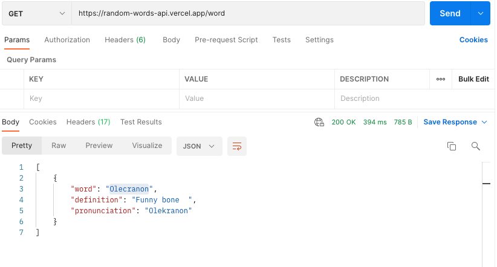

# Project Overview

## bee.wordly

## Project Description
An app that gives you a word of the day, along with search functions for definitions and synonyms, flashcards, and a spelling game to help you 'bee wordly'!

## API and Data Sample

I'll be using the Merriam Webster Dictionary API for word details and audio files:
https://www.dictionaryapi.com/api/v3/references/collegiate/json/


Merriam Webster Thesaurus for synonyms:
https://www.dictionaryapi.com/api/v3/references/thesaurus/


And I haven't decided yet if I will create my own word randomizer, or use a random words API: 
https://random-words-api.vercel.app/word


## Wireframes

Here is the wireframe for the mobile layout of the app:

#### MVP 

- Pull data from dictionary, thesaurus and random word API 
- Parse API data
- Create random word of the day 
- Create search function to look up words
- Create search function to look up synonyms
- Create spelling bee game
- Responsive design

#### PostMVP  

- Add second word game using thesaurus API
- Use local storage to save studied words
- Create more dynamic game features (keep score, animations)

## Project Schedule

|  Day | Deliverable | Status
|---|---| ---|
|August 27-29| Prompt / Wireframes / Priority Matrix / Timeframes | Incomplete
|August 30| Project Approval / Set up HTML, CSS Structure / Pseudocode JS | Incomplete
|August 31| Code axios calls & search functions | Incomplete
|September 1| Code game / CSS | Incomplete
|September 2| Finish CSS / Start Post MVPs  | Incomplete
|September 3| Presentation | Incomplete


## Priority Matrix


## Timeframes

| Component | Priority | Estimated Time | Time Invested | Actual Time |
| --- | :---: |  :---: | :---: | :---: |
| Structure HTML/CSS | H | 2hrs|  |  |
| Set up axios calls | H | 2hrs|  |  |
| Parse API data for words | H | 2hrs|  |  |
| Parse API data for audio | H | 3hrs|  |  |
| Create dictionary search function | H | 3hrs|  |  |
| Create Thesaurus search function | H | 3hrs|  |  |
| Create 'Word of the Day' function | H | 2hrs|  |  |
| Create flashcard function | H | 2hrs|  |  |
| Create spelling game | H | 3hrs|  |  |
| Style spelling game | M | 3hrs|  |  |
| Style 'Word of the Day' card | M | 2hrs|  |  |
| Style flashcards | M | 2hrs |  |  |
| Design media queries | H | 3hrs|  |  |
| Create synonym game | L | 3hrs|  |  |
| Continue styling games | L | 2hrs|  |  |
| Add additional game features | L | 3hrs|  |  |
| Add local storage function | L | 2hrs|  |  |
| Total (MVP) | H | 32hrs|  |  |

## Code Snippet

Below is the async function for getting data from the dictionary API. Figuring out the format of the audio URL for the word pronunciations was tricky, but this works!

```
const dictBaseURL = 'https://www.dictionaryapi.com/api/v3/references/collegiate/json/';
const dictKey = '?key=9aed0fc9-9efb-4167-83b0-c665d40f56b7';
const audioBaseURL = 'https://media.merriam-webster.com/audio/prons/en/us/mp3/';

async function getDictEntry(word) {
    try{
        // get data for word from dictionary API
        let res = await axios.get(`${dictBaseURL}${word}${dictKey}`);
        let definition = res.data[0].shortdef[0];
        let pos = res.data[0].fl;
        let audio = res.data[0].hwi.prs[0].sound;
        let audioName = audio.audio;
        let audioSub = '';

        // get data for correct format of audio URL of word
        if (audioName.substring(0,2) === 'g') {
            audioSub = 'gg';
        } else if (audioName.substring(0,3) === 'bix') {
            audioSub = 'bix';
        } else {
            audioSub = audioName[0];
        }

        let audioURL = `${audioBaseURL}${audioSub}/${audioName}.mp3`;
        
        return {
            definition,
            pos,
            audioURL,
        }
    } catch (error) {
        console.log(error);
    }
 }
```

## Change Log
  
